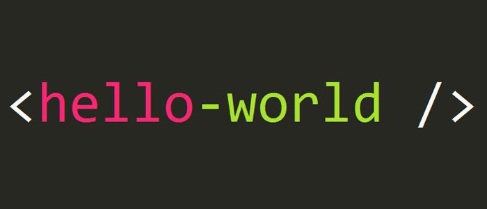

<h1 align="left">Developer Adventures 🚀</h1>

###

💻 Hello world! I'm Yanis Meichtry, a developer on a mission from Zürich (Switzerland)

###

<h3 align="left">About me</h3>

###

🚀 As an aspiring application developer, programming is my daily companion. I have been fascinated by this world since my first code experiments.  💻 I love to use my skills in projects, whether professionally, at school, or privately. You can find out more about my previous projects on my projects page. The variety of languages and technologies inspires me. Discover more on my skills page.  🌟 Programming is an endless journey of learning and discovery. I always strive for further development and innovation. This passion accompanies me on my journey.  🎵 My music taste is eclectic, ranging from rock and indie to electronic music. I enjoy discovering new artists and bands and constantly expanding my playlists.   My Spotify artist account: https://open.spotify.com/artist/4Ty32nWD7ngr6anP9cAywy?si=-mJ8x607Ta-6i8pOtmJ70w 

###

<h2 align="left"></h2>

###

###

<h2 align="left"></h2>

###

  
  
  
  
  

###

<h2 align="left"></h2>

###
